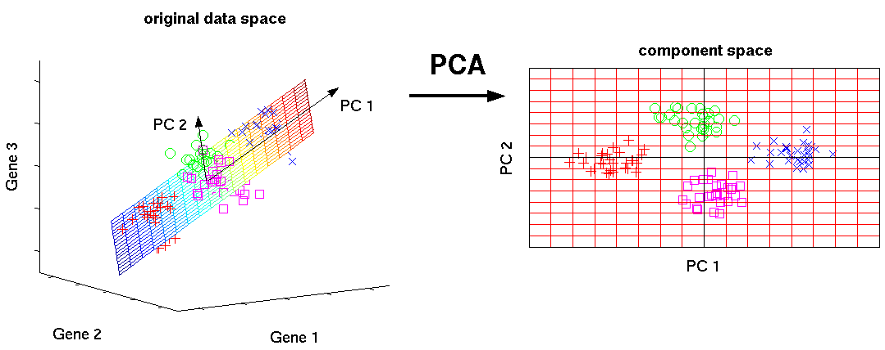
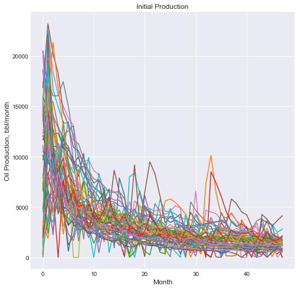
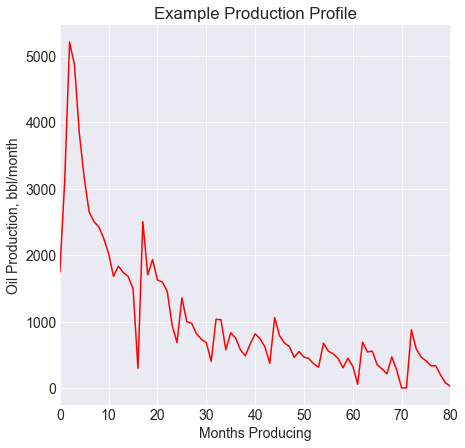
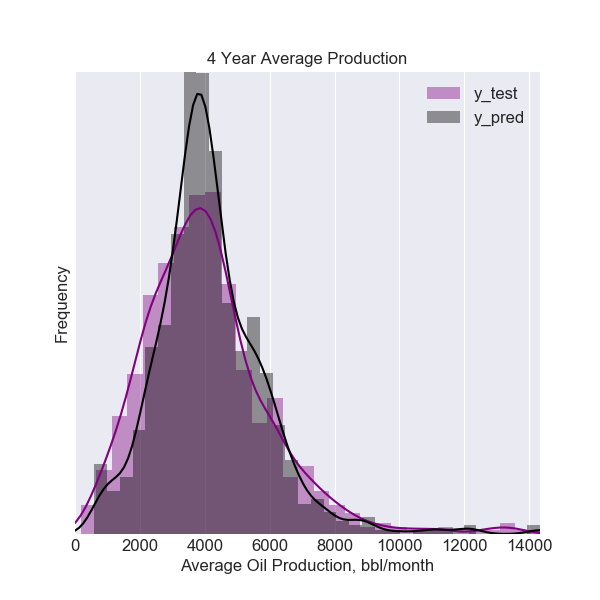
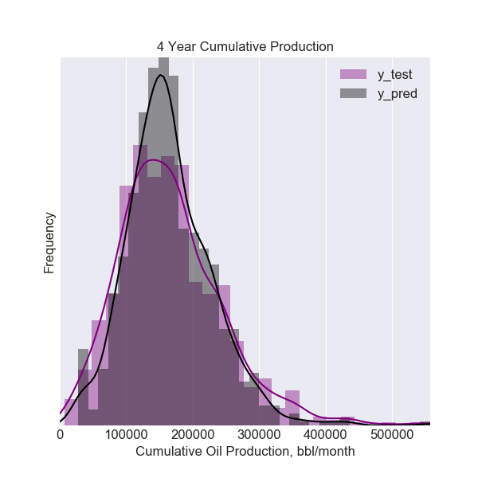
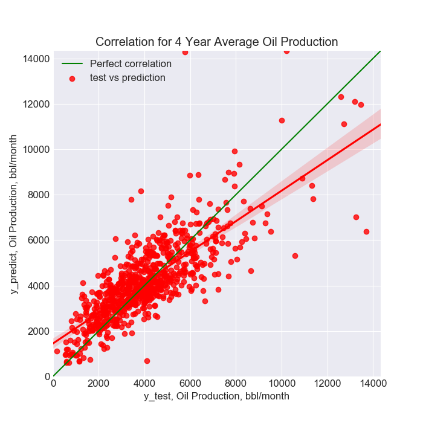

# Predicting Well Production

John Carrigan

--- 
Can oil production metrics be predicted using basic drilling, completion, and geologic data?

# Table of Contents

1. [Introduction](#introduction)
2. [Data](#data)
3. [Production Metric](#production-metric)
    * [Target Variable](#target-variable)
    * [Expanded Utility](#expanded-utility)
4. [Predictive Modeling](#predictive-modeling)
    * [Model Selection](#model-selection)
    * [Model Evaluation](#model-evaluation)
5. [Conclusions](#conclusions)
6. [Appendix](#appendix)
7. [References](#references)

## Introduction

 An undisclosed company is looking to purchase assets in an undisclosed location. To inform their investment an evaluation of the assets in question must be conducted. Forecasting production plays a large role in estimating an asset’s profitability. Traditionally this is done through an engineering approach that can be data, time,and labor intensive. Oil production is influenced by a variety of factors, from the inherent reservoir characteristics, to the specific method of drilling and completing each well. Acquiring the data to perform this analysis can also be prohibitively expensive.The objective of this project is to determine if this process can be replicated in a more efficient and less time and data intensive manner.
 
 ### Objectives
 
   * Create a model using basic drilling, completion, and geologic data to predict oil and gas production
   * Determine which variables were most predictive of oil production volumes. 

---

## Data

The dataset included 13,000 wells and 14 different files containing various geologic, drilling, and completion data, which is not made available.

### Methodology 

The data first had to be joined together using Pandas on API Number, a unique number given to all wells drilled domestically. A non-nominal amount of variables were neglected during this process, with the information deemed irrelevant, or too sparse to be of use. When completed, the final feature matrix included ~50 numerical variables and ~20 categorical values. Much of the dataset possessed missing values, with the range of missing data amounting to 5-75% missing values. Due to the skewed nature of many of the variables, the median of each feature was used to replace missing values.

At this point, multiple approaches were taken to determine the optimal feature matrix to train a model on. These include:
   * Numerical values only
   * Reducing dimensionality of categorical dummy variables using Principal Component Analysis (PCA)
   * Using 10 most important features from previous models (more detail below)
   
 **Principal Component Analysis**
 
 In simple terms, Principal Component Analysis or PCA is used to reduce the dimensionality of correlated variables into a lower dimensional space. PCA finds the directions of maximum variance in high-dimensional data and projects it onto a smaller dimensional subspace while retaining most of the information. This can be beneficial for improved model performance and data visualization. Below describes in detail how to perform PCA. [References](#references)
  
 
 [References](#references)
 
  
 **Fig. 1 - Visualization of dimensionality reduction of data from three dimensions to two**
 [References](#references)

## Production Metric

Once a feature matrix was created, a target variable was then necessary for our model to learn to predict. With oil production data being time series in nature, one either must create a time series model or translate this time series data into a single target variable. While time series modeling is beyond the scope of this current project, it would be a constructive future pursuit. Three different metrics were ultimately used to describe production over time: average, cumulative, and peak production. The production information provided was in oil barrels per month.

**Fig. 2 - Production profiles for 50 wells from the dataset, normalized to initial production data**

### Target Variable

Once these metrics were decided upon, comparing wells over similar time periods was necessary for our particular metrics to accurately capture the production characteristics of a particular well. As can be seen above, oil wells inititally produce at a high volume, and decline gradually as time passes, typically at an exponential or hyperbolic rate. To compare wells like for like, I started first with a time period to analyze production over, in years. Since wells can be shut in for a period of time for a variety of reasons, only wells that produced on average more than three weeks per month were selected. Wells were then selected that had only produced for the time period desired. Then wells were selected that had produced this amount in the most recent n years desired, within one year, to ensure were comparing wells at the similar points in their production life. From this subset wells that had less than 25% no production months were included in metric calculation. The production data over our desired time period was averaged, summed, and the maximum was taken to create the metric to be used as our target variable.

 

**Fig. 3 - Production profile and corresponding production metrics**

### Expanded Utility 

Initially these metrics were only created to look at the most recent two-year and five-year production wells. The functionality of this method was then expanded to look at any particular length of time. This method can be seen in the feature_matrix.py file.  

## Predictive Modeling

Once the feature matrix and target variables were in place, the two were merged once again based on API Number. A train-test split was  then performed on the data to prepare for model selection and evaluation.

Three models were created for each time period in question: models to predict average, cumulative, and peak production over the specified time interval

### Model Selection

A variety of regression models were attempted for each metric, including Linear Regression with and without regularization, ensemble tree methods including Random Forest and Gradient-Boosted models, as well as a simple perceptron basic neural network. Models were scored based on root mean-squared error (RMSE) and R-squared values on the training set using k-fold cross validation. The final model selected was the Yandex algorithm CatBoosterRegressor. Hyperparameters were tuned using GridSearch. However, little benefit was accrued, and fine-tuning of each particular model was abandoned based upon effieciency and time restraints.

Referring to the feature matrices mentioned above, models were trained on each specific feature matrix. The results from each model were comparable, with the feature matrix including PCA yielding the highest evaluation scores. Below details the results from the feature matrix including PCA.

### Model Evaluation

Below details the RMSE and R-squared values for models over different time periods. With relatively high error and low R-Squared values, the models were not able to precisely model the production metrics in question. 

Distribution comparisons between the actual production metrics and predicted values are provided below. While these models were unable to fully predict the production information in question, they did capture the general nature of the production information.

The figure below illustrates the relative accuracy of predictions for the four year production models.

## Conclusions

Many of the models also saw similarities in their feature importances. Below details the top 10 features for the average production over the most recent five years. 

The results are mostly unsurprising. Material pumped during frac jobs and initial production volumens are shown to be correlated with eventual production. The importance of location parameters is a bit more intriguing. Further investigation into these insights is required to describe the reasoning behind this finding.

Moving forward, these models could be used to predict long term well performance for wells that have recently been drilled or only produced for a short time. Overall, given the high error numbers and the average r-squared values, additional work is necessary for these models to supplant traditional engineering techniques to evaluate a particular oil and gas asset. This approach may be useful in circumstances where time or data is limited. Acquiring more geologic data, time-series forecasting, and kernal smoothing are all additional actions that could improve the utility of this project.   

## Appendix

Please refer to the Plots folder to view the results of the various models over different time periods. The folder includes model results for average, cumulative, and peak production over the most recent 2-10 year timeframes. 

Well counts for each model are also included.

## References

  * [Production Performance Metrics](http://www.verdazo.com/blog/what-production-performance-measure-should-i-use/)
  * [Principal Component Analysis](http://sebastianraschka.com/Articles/2015_pca_in_3_steps.html#a-summary-of-the-pca-approach)

* Tech Stack
   * Python
   * Numpy
   * Pandas
   * Sci-Kit Learn
   * Catboost
   * Seaborn
   * Matplotlib
